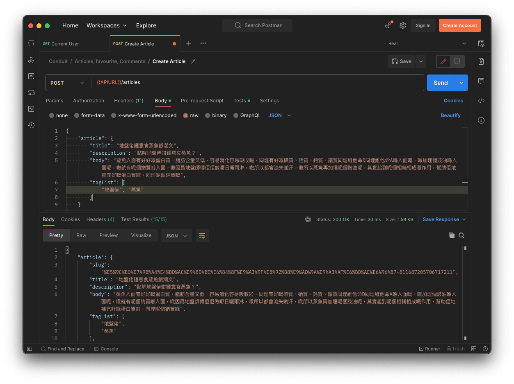

# 


[廣東話 (Cantonese)](#廣東話) 

> ### C++, Oat++, POCO codebase containing real-world examples (CRUD, auth, MVCS patterns, etc.) that adheres to the [RealWorld](https://github.com/gothinkster/realworld) specification and API.

This codebase was created to demonstrate a fully-fledged full-stack application built with **C++, Oat++, POCO**, including CRUD operations, authentication, routing, pagination, and more.

For more information on how this works with other frontends/backends, head over to the [RealWorld](https://github.com/gothinkster/realworld) repository.

### Links

*   [Project Docker Repository](https://hub.docker.com/r/yukaitung/realworld-oat-poco)

# Try To Use British English

All API endpoints, parameters and source code, should use British English. Please change `favorite` into `favourite` when evaluating the project.

# How it works
### Software

This project uses Oat++ and POCO. Below are their functions.

Oat++:

* Hosting a RESTful API
* Authenticating a user
* Validating user input
* Running API tests
* Integrating with Swagger UI

POCO:

* Generating and validating JWT Token
* Connecting to MySQL server
* Handling timezone

### MVCS Pattern

This project follows the MVCS pattern [(Example)](https://github.com/oatpp/example-crud) [(What is MVCS)](https://stackoverflow.com/questions/5702391/mvcs-model-view-controller-service). Below is how the project interprets the MVCS.

* The user sends a request
* The Controller authenticates the user and selects the corresponding Service
* The Service validates the data in the request, then selects the corresponding Model
* The Model inserts, updates, or deletes data from MySQL, then returns the data to the Service
* The Service may get more data from the Model, then returns the completed data to the Controller
* The Controller returns the data to the user

### Unicode Support

Most operating systems should support Unicode out-of-the-box (except on Microsoft Windows? Not sure). You can insert data using a Unicode-supported language. The below screenshot is inserting some Cantonese data in macOS. The slug is encoded into the URI.



# Getting started

### Prerequisite

This project requires a C++ compiler, CMake 2.23, [Conan 2.0](https://conan.io/), MySQL, and pip. In macOS, [Homebrew](https://docs.brew.sh/Installation) can be an alternative to pip.

### Build

To build the project on Linux / macOS, navigate to the project folder.

If your Conan is freshly installed.

```bash
conan profile detect --force
```

Then run the following commands, replace the `/usr/include/mysql` if your MySQL is installed in another directory.

```bash
conan install . --output-folder=build --build=missing
cd build
cmake .. -DCMAKE_CXX_FLAGS=-isystem\ /usr/include/mysql -DCMAKE_TOOLCHAIN_FILE=conan_toolchain.cmake -DCMAKE_BUILD_TYPE=Release
cmake --build . -j`nproc` # Linux
cmake --build . -j$(sysctl -n hw.ncpu) # macOS
```

### Run

You need to set up environment variables before executing the program. Then you should create the SQL schema, refer to [realworld.sql](sql/realworld.sql)

```bash
export REALWORLD_DB_HOST=<MySQL Server IP>
export REALWORLD_DB_PORT=<MySQL Server Port>
export REALWORLD_DB_NAME=<Database name>
export REALWORLD_DB_USER=<MySQL Server Username>
export REALWORLD_DB_PASSWORD=<MySQL Server Password>
export REALWORLD_SIGNER_SECRET=<Some secret for JWT signer>
./Realworld
```

### Test

If you would like to run the test, you should create the SQL schema as well, refer to [realworld.sql](sql/realworld.sql).

```bash
export REALWORLD_TEST_DB_HOST=<MySQL Server IP>
export REALWORLD_TEST_DB_PORT=<MySQL Server Port>
export REALWORLD_TEST_DB_NAME=<Database name>
export REALWORLD_TEST_DB_USER=<MySQL Server Username>
export REALWORLD_TEST_DB_PASSWORD=<MySQL Server Password>
export REALWORLD_TEST_SIGNER_SECRET=<Some secret for JWT signer>
./Realworld-test
```

You can set the environment variable below to clean the database before running the tests.

```bash
export REALWORLD_TEST_TRUNCATE_DB=1
```

### Docker

You can build the Docker image on Docker-supported operating systems.

```bash
docker build -t realworld .
docker run -p 8000:8000 -e "REALWORLD_DB_HOST=<MySQL Server IP>" -e "REALWORLD_DB_PORT=<MySQL Server Port>" -e "REALWORLD_DB_NAME=<Database name>" -e "REALWORLD_DB_USER=<MySQL Server Username>" -e "REALWORLD_DB_PASSWORD=<MySQL Server Password>" -t realworld
```

### GitLab CI/CD

This project contains a GitLab CI/CD script. It automatically builds the executable and Docker image, runs the tests, and finally uploads the Docker image to docker.io. Refer to the [.gitlab-ci.yml](.gitlab-ci.yml) script for more details.

### Test the program

You can use the [Postman Collection](test/Conduit.postman_collection_uk.json) to test the project. Additionally, this project is integrated with Swagger UI. Navigate to [http://localhost:8000/swagger/ui](http://localhost:8000/swagger/ui) to try it on the browser.

# 廣東話
# 

> ### C++、Oat++、POCO 現實應用原始碼 (CRUD、使用者驗證、MVCS pattern等) 符合 [RealWorld](https://github.com/gothinkster/realworld) 規格及 API。

本原始碼是用來展示以 **C++、Oat++、POCO** 建立的完整應用程式，包括 CRUD、使用者驗證、routing、分頁等功能。

如需更多關於如何與整合其他 Frontend / Backend 的資訊，請參考 [RealWorld 的 GitHub repository](https://github.com/gothinkster/realworld)。

### Links

*   [本項目的 Docker Repository](https://hub.docker.com/r/yukaitung/realworld-oat-poco)

# 嘗試使用英式英文

所有 API endpoints, 參數及原始碼都使用英式英文。測試本項目時請將`favorite`更改為`favourite`。

# 軟件運作方式
### 軟件

本項目使用了 [Oat++](https://oatpp.io/) 以及 [POCO](https://pocoproject.org/)。以下是它們的功能

Oat++：

* 寄存 RESTful API (口語：Host 一個 RESTful API)
* 使用者驗證
* 校驗使用者輸入
* 執行 API 測試
* 整合 Swagger UI

POCO：

* 生產及驗證 JWT Token
* 連接 MySQL 數據庫
* 處理時差

### MVCS Pattern

本項目跟隨 MVCS pattern [(例子)](https://github.com/oatpp/example-crud) [(什麼是 MVCS)](https://stackoverflow.com/questions/5702391/mvcs-model-view-controller-service)。以下是本項目對 MVCS 的解釋。

* 使用者傳送了一個 request
* Controller 驗證使用者及轉發至有關 Service
* Service 校驗使用者輸及選擇有關 Model
* Model 新增、修改及刪除 MySQL 數據庫內的資料，然後將資料傳送至 Service
* Service 可能再由 Model 提取資料，然後將完成的數據傳送至 Controller
* Controller 然後將數據傳送至使用者

### 統一碼 (Unicode) 支援

大部份作業系統都支援統一碼(不太肯定視窗作業系統是否支援)。你可以用統一碼支援的語言新增資料。以下截圖表示了以廣東話在 macOS 新增資料。圖中 Slug 轉換為 URI 編碼。


# 如何使用

### 軟件要求

本項目需要在電腦上安裝 C++ 編譯器, CMake 2.23, [Conan 2.0](https://conan.io/), MySQL, 及 pip。在 macOS 可使用 [Homebrew](https://docs.brew.sh/Installation) 取代 pip。

### 編譯

要在 Linux / macOS 編譯項目，首先前往項目所在的資料夾內。

如果你剛安裝 Conan

```bash
conan profile detect --force
```

然後執行以下指令，如果 MySQL 數據庫安裝在其他地方，請更改 `/usr/include/mysql`。

```bash
conan install . --output-folder=build --build=missing
cd build
cmake .. -DCMAKE_CXX_FLAGS=-isystem\ /usr/include/mysql -DCMAKE_TOOLCHAIN_FILE=conan_toolchain.cmake -DCMAKE_BUILD_TYPE=Release
cmake --build . -j`nproc` # Linux
cmake --build . -j$(sysctl -n hw.ncpu) # macOS
```

### 執行程式

在執行程式前，你需要設定一些 environment variables。然後建立 MySQL 數據庫，參考檔案 [realworld.sql](sql/realworld.sql)

```bash
export REALWORLD_DB_HOST=<MySQL Server IP>
export REALWORLD_DB_PORT=<MySQL Server Port>
export REALWORLD_DB_NAME=<Database name>
export REALWORLD_DB_USER=<MySQL Server Username>
export REALWORLD_DB_PASSWORD=<MySQL Server Password>
./Realworld
```

### 執行測試

如果你想執行測試，首先建立 MySQL 數據庫，參考檔案 [realworld.sql](sql/realworld.sql)。

```bash
export REALWORLD_TEST_DB_HOST=<MySQL Server IP>
export REALWORLD_TEST_DB_PORT=<MySQL Server Port>
export REALWORLD_TEST_DB_NAME=<Database name>
export REALWORLD_TEST_DB_USER=<MySQL Server Username>
export REALWORLD_TEST_DB_PASSWORD=<MySQL Server Password>
./Realworld-test
```

你可以設定以下 environment variable ，當執行測試時會清除數據庫。

```bash
export REALWORLD_TEST_TRUNCATE_DB=1
```

### Docker

你可以在 Docker 支援的作業系統中建立一個 Docker image

```bash
docker build -t realworld .
docker run -p 8000:8000 -e "REALWORLD_DB_HOST=<MySQL Server IP>" -e "REALWORLD_DB_PORT=<MySQL Server Port>" -e "REALWORLD_DB_NAME=<Database name>" -e "REALWORLD_DB_USER=<MySQL Server Username>" -e "REALWORLD_DB_PASSWORD=<MySQL Server Password>" -t realworld
```

### GitLab CI/CD

這個 script 會自動編譯項目執行檔和 Docker image、執行測試、將 Docker image 上傳至 docker.io 。參考檔案 [.gitlab-ci.yml](.gitlab-ci.yml)。

### 測試程式

你可以使用 [Postman Collection](test/Conduit.postman_collection_uk.json) 來測試，或者在瀏覽器進入 [http://localhost:8000/swagger/ui](http://localhost:8000/swagger/ui) 使用 Swagger UI 來測試。
